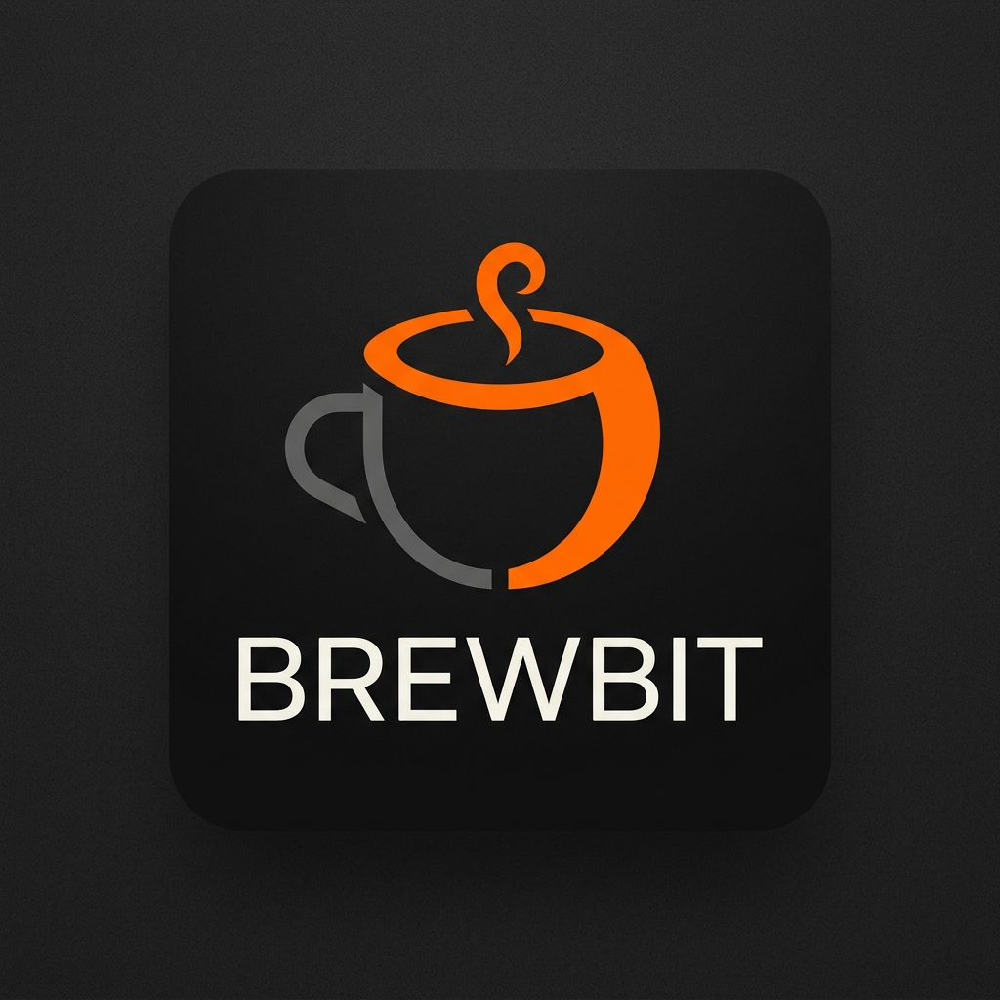

<div align="center">
  
  
  # Brewbit POS — Smart Cafe Management

  A high-performance, full-stack Point of Sale (POS) system tailored for modern cafes and restaurants.
  
  
  
  
  
  
  
</div>

<br />

Brewbit POS is not just a standard point-of-sale system; it is a **comprehensive digital ecosystem** designed to bridge the gap between cafe management and customer experience. By operating on dual, hyper-optimized modules, Brewbit ensures that every interaction—from the kitchen to the customer's phone—is completely synchronized and frictionless.

Built on a robust Turborepo monorepo architecture, Brewbit POS guarantees 100% end-to-end type safety using tRPC and effortless database migrations via Drizzle ORM. 

### ✨ What makes Brewbit unique?
- 🎭 **Dual Ecosystems:** A powerful, data-rich backend dashboard for administrative staff, paired seamlessly with a lightweight, intuitive customer-facing portal.
- ⚡ **Real-Time Synergy:** When a customer scans a QR code to pay, the Kitchen Display System (KDS) and the Floor Plan automatically update instantly—no manual refreshes required.
- 🎨 **Premium Aesthetics:** Dark-mode by default, utilizing a gorgeous `oklch` color science palette and fluid UI interactions that feel satisfying to use.
- 🔐 **Bulletproof Architecture:** Fully typed API boundaries mean that if a database column changes, the frontend catches the error at compile-time.

---

## 📥 Download & Access

You can access and deploy the Brewbit POS system in multiple ways:

- 🌐 **Live Demo:** https://brewbit-pos.vercel.app
- **💻 Desktop Client (PWA):** Install Brewbit directly to your desktop or tablet via your browser's "Install App" feature for a native-like full-screen kiosk experience.
- **📦 Source Code:** Clone the repository below to run it locally or deploy it to Vercel/Railway.

---

## 🚀 Quick Start

Get your local development environment up and running in minutes.

```bash
# 1. Clone the repository
git clone https://github.com/githubmofo/Brewbit-POS.git
cd Brewbit-POS

# 2. Install dependencies (Using npm workspaces)
npm install

# 3. Setup environment variables
cp apps/web/.env.example apps/web/.env
# (Fill in your Postgres Database URL in the .env file)

# 4. Generate & Push Database Schema
npm run db:generate
npm run db:migrate

# 5. Seed the database with initial products and tables
cd apps/web && npm run db:seed && cd ../../

# 6. Start the development server
npm run dev
```

Open [http://localhost:3000](http://localhost:3000) in your browser to view the application.

## 💻 Requirements

To run this project, you will need the following installed:
- **Node.js**: v20 or higher
- **Package Manager**: npm v11+
- **Database**: PostgreSQL 15+

## 📁 Project Structure

Brewbit POS is organized as a Turborepo monorepo:

```text
odoo-pos-cafe/
├── apps/
│   └── web/                   # Main Next.js App Router application
│       ├── src/app/           # Next.js Routes
│       │   ├── (backend)/     # Management Dashboard (Reports, Products, Floor Setup)
│       │   └── (pos)/         # Operational POS (Floor Map, Order Checkout, KDS)
│       ├── src/server/        # Backend tRPC routers & Drizzle DB schema
│       └── src/components/    # Reusable UI & Layout components
├── packages/
│   ├── config/                # Shared configurations (TypeScript, ESLint/Biome)
│   ├── ui/                    # Shared UI library 
│   └── validators/            # Shared Zod schemas (API validation)
└── package.json               # Monorepo root config
```

## ⚙️ Environment Variables

The application requires specific environment variables to function properly. You must create a `.env` file inside `apps/web/`.

| Variable | Required | Description |
|---|---|---|
| `DATABASE_URL` | Yes | Your PostgreSQL connection string. |
| `NODE_ENV` | No | `development` or `production` |

## 🛠️ Scripts & Commands

From the root directory, you can run the following Turborepo commands:

```bash
npm run dev           # Start the development server across all apps
npm run build         # Build the application for production
npm run lint          # Run Biome checks for formatting and linting
npm run format        # Auto-format codebase via Biome
npm run db:generate   # Generate Drizzle migration files
npm run db:migrate    # Push migrations to the database
npm run db:studio     # Open Drizzle Studio for visual DB management
```

## 🛡️ Enterprise-Grade Security

Brewbit POS is engineered with a **100% security-first architecture**, heavily audited and protected against modern web vulnerabilities, hacking attempts, and data leaks.

- **100% SQL Injection Proof:** All database interactions are natively parameterized through Drizzle ORM, completely neutralizing SQL injection vectors.
- **Strict Role-Based Access Control (RBAC):** Backend logic explicitly guards all administrative and POS actions (e.g., cash drawer sessions, manual payment confirmation, table state modifications) via strongly typed backend middleware. Customers cannot escalate privileges or access staff POS functionalities.
- **Insecure Direct Object Reference (IDOR) Prevention:** Customer resources are strictly validated against their authorization tokens, ensuring customers can only access and modify their own orders and data.
- **Robust Authentication:** Implements secure JWT session management with strong bcrypt hashing (12 rounds), environment-level secret enforcement, and strict password policies.

## 🔐 Core Features & Platform Breakdown

Brewbit POS is split into two powerful, distinct ecosystems. It ensures that administrative staff have total control over operations, while customers experience a frictionless, intuitive self-service environment.

### 🛡️ Admin & Staff Portal
The management and operational backend tailored for cafe staff, cashiers, and managers.

- **Interactive Floor Plan Management:** Drag & drop interface to visually map out tables, edit seating arrangements, and instantly see real-time table occupancy.
- **Smart Kitchen Display System (KDS):** A live, auto-updating chronological order queue. Chefs see orders stacked vertically (newest at bottom) with clear priority badges (e.g., "Urgent", "Medium").
- **Table-Side Ordering & POS Checkout:** Cashiers can open bills for specific tables, add items, apply taxes, and process multi-tender payments seamlessly.
- **Comprehensive Reporting Dashboard:** Real-time analytics displaying Total Revenue, Average Order Value, Top Selling Products, and Order Volume. 
- **Session & Drawer Tracking:** Track daily register sessions. Cashiers must open a session at the start of their shift and close it at the end, ensuring full financial reconciliation.
- **Inventory & Product Control:** Full CRUD interface for managers to update menus, categorize items (e.g., 'Pizza', 'Beverages'), and set dynamic pricing.

### 👤 Customer Portal
A frictionless self-service environment designed for cafe patrons.

- **Self-Service Sign In & Registration:** Customers can quickly create an account or sign in using the dedicated Customer Gateway on the login page.
- **Digital Ordering:** (Upcoming) Customers can view the live menu, place orders directly from their tables, and track their order status without needing to flag down a waiter.
- **Instant Digital Payments:** Scan-to-pay UPI QR code generation allows customers to settle their bills instantly from their mobile devices.
- **Order History:** Customers can review their past visits, favorite orders, and receipts.

## 🤝 Contributing

1. Fork the repository
2. Create your feature branch (`git checkout -b feature/amazing-feature`)
3. Commit your changes (`git commit -m 'Add amazing feature'`)
4. Push to the branch (`git push origin feature/amazing-feature`)
5. Open a Pull Request

## 👨‍💻 Author

**Jenish Lad**
